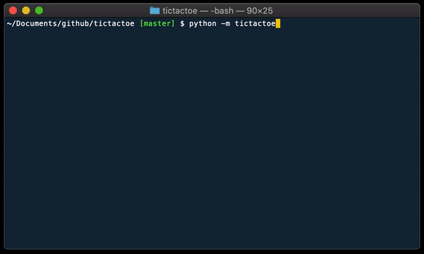

# tictactoe

Tic-tac-toe implementation in Python with a trainable CPU opponent (trained through self-play).

## Installation

#### From GitHub with `pip`

The below command will not install the CPU opponent's training knowledge.

```bash
pip install git+https://github.com/AdamSpannbauer/tictactoe.git
```

#### From GitHub through cloning

Will include the CPU opponent's training knowledge stored in this repo (`cpu_knowledge.pickle`).

```bash
git clone https://github.com/AdamSpannbauer/tictactoe.git
cd tictactoe
pip install .
```


## Usage

### GUI

```python
raise NotImplementedError('Come back later...')
```

#### Command Line interface

Once installed tictactoe can be played with the below command.  Use the `-h` flag to see all arguments and their documentation

```bash
# Play
python -m tictactoe

# See documentation for other options
python -m tictactoe -h
```

The CLI can also be started via Python.

```python
from tictactoe import TicTacToe

ttt = TicTacToe()
ttt.play()
```


<p align='center'>
  
</p>

